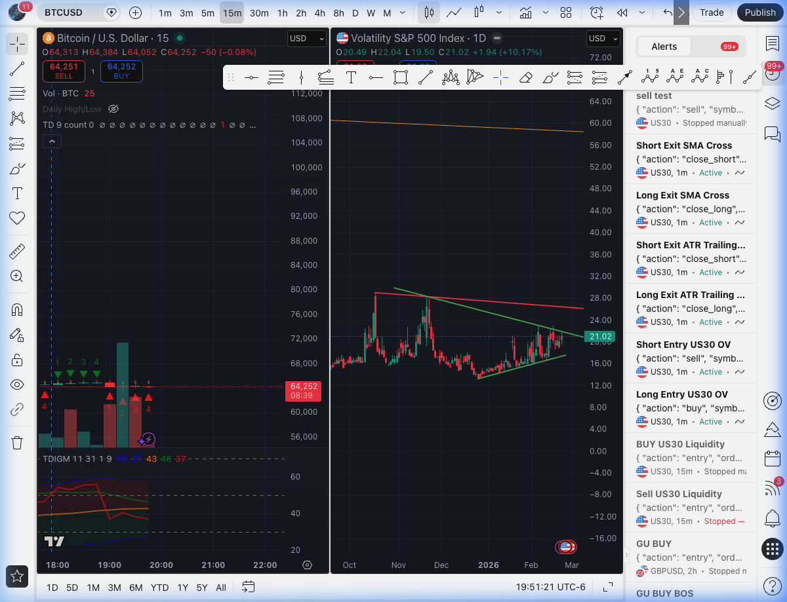

# Alert: BTCUSD (15m)
**Date & Time:** 2026-02-23 18:50:00
**Action:** `buy` (First 20 Min Breakout)

## Visual Snapshot

## The Trading Manifesto Analysis

### 1. Candle Body (Expected: > 60% of range)
❌ **FAIL:** The most recent candle on the 15m timeframe is a small doji/spinning top with significant wicks. It lacks the strong momentum body required for a valid breakout entry.

### 2. RSI (Expected: 50-70)
⚠️ **MARGINAL:** The embedded oscillator shows momentum is flat and potentially trending downward, lacking the strong 50-70 bullish posture.

### 3. 200 EMA (Expected: Price Above)
✅ **PASS:** Price (64,252) appears to be holding the higher structure overall, but the immediate MA ribbons are tangled.

### 4. Volume (Expected: > 20MA)
❌ **FAIL:** The volume on the trigger candle is extremely low compared to the preceding average. There is no institutional push visible.

---

## Final Decision: REJECTED 🛑
**Rationale:** Proceeding with this trade would violate the principle of "Exercising Diligence over Haste". The visual evidence directly contradicts the signal; there is no strong candle body and no supporting volume to justify a breakout entry. Capital is preserved.
